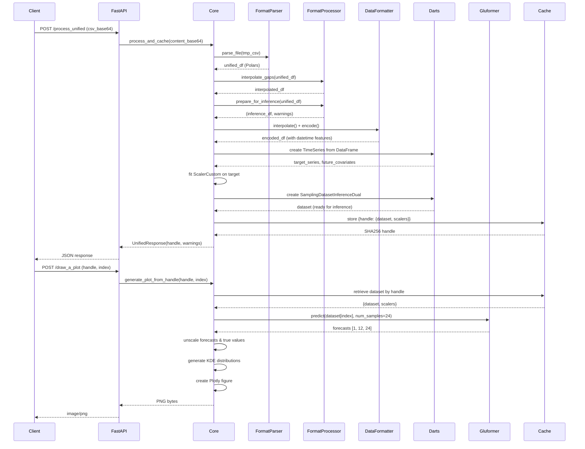

# GluRPC Implementation Guide

**Technical documentation for the GluRPC glucose prediction service.**

---

## Table of Contents

1. [Architecture Overview](#architecture-overview)
2. [Data Flow Pipeline](#data-flow-pipeline)
3. [Model & Inference](#model--inference)
4. [API Implementation](#api-implementation)
5. [Caching Strategy](#caching-strategy)
6. [Data Processing Details](#data-processing-details)
7. [Scaling & Transformations](#scaling--transformations)
8. [Plotting & Visualization](#plotting--visualization)
9. [Error Handling](#error-handling)
10. [Performance Considerations](#performance-considerations)

---

## Architecture Overview

### Technology Stack

```
┌─────────────────────────────────────────────────┐
│                   Client Layer                   │
│         (HTTP/JSON - REST API Requests)         │
└──────────────────┬──────────────────────────────┘
                   │
┌──────────────────▼──────────────────────────────┐
│              FastAPI Application                 │
│  - Request validation (Pydantic)                │
│  - Routing & endpoint handlers                  │
│  - Swagger/OpenAPI documentation                │
└──────────────────┬──────────────────────────────┘
                   │
┌──────────────────▼──────────────────────────────┐
│               Core Logic Layer                   │
│  - CSV parsing & format detection               │
│  - Data quality checks & warnings               │
│  - Time series processing                       │
│  - Model inference orchestration                │
└──────────────────┬──────────────────────────────┘
                   │
┌──────────────────▼──────────────────────────────┐
│            Dependencies Layer                    │
│  - cgm-format: Multi-format CGM parsing         │
│  - glucobench: Gluformer model utilities        │
│  - Darts: Time series dataset creation          │
│  - PyTorch: Neural network inference            │
│  - Plotly: Visualization generation             │
└──────────────────────────────────────────────────┘
```

### Module Structure

```
glurpc/
├── app.py              # FastAPI app, endpoint definitions, lifespan management
├── core.py             # Business logic: parsing, processing, inference, plotting
├── schemas.py          # Pydantic models for API request/response validation
└── data_classes.py     # Gluformer configuration models
```

---

## Data Flow Pipeline

### Complete Request Flow



---

## Model & Inference

### Gluformer Architecture

The Gluformer model is a Transformer-based architecture specifically designed for glucose prediction:

```
Input Components:
├─ Past Target:                [batch, 96, 1]     # 8 hours glucose history
├─ Historic Future Covariates: [batch, 96, 6]     # Datetime features for input
├─ Future Covariates:          [batch, 12, 6]     # Datetime features for prediction
└─ Static Covariates:          [batch, 1]         # Subject ID

       ↓ Embedding Layer

Encoder:
├─ 2 Encoder Layers
│  ├─ Multi-head Self-Attention (10 heads)
│  ├─ Feed-Forward Network (d_model=512, d_fcn=1024)
│  └─ Dropout (r_drop=0.2)
└─ Output: [batch, 96, 512]

Decoder Input:
└─ [Last 32 points of input | 12 zeros] → [batch, 44, 1]

Decoder:
├─ 2 Decoder Layers
│  ├─ Masked Self-Attention
│  ├─ Cross-Attention to Encoder
│  ├─ Feed-Forward Network
│  └─ Dropout (r_drop=0.2)
└─ Output: [batch, 44, 512]

Output Projection:
├─ Linear: d_model → 1
├─ Extract last 12 positions
└─ Prediction: [batch, 12, 1]
```

### Inference Process

**Monte Carlo Dropout for Uncertainty:**

1. **Model State**: Set to `train()` mode (NOT `eval()`) to activate dropout
2. **No Training**: No backpropagation, no gradient computation, weights frozen
3. **Stochastic Sampling**: Run 24 forward passes with different dropout masks
4. **Output Shape**: `[n_samples, 12, 24]` where 24 = number of stochastic samples

**Code Flow:**

```python
def predict(self, test_dataset, batch_size=1, num_samples=24, device='cuda'):
    # Step 1: Repeat each input num_samples times
    collate_fn_custom = modify_collate(num_samples)
    test_loader = DataLoader(test_dataset, batch_size=1, 
                            shuffle=False, collate_fn=collate_fn_custom)
    
    # Step 2: Set model to training mode (for dropout)
    self.train()  # Enables dropout, but NO gradient computation
    
    # Step 3: Forward pass with torch.no_grad()
    for batch in test_loader:
        past_target, historic_covs, future_covs, static_covs = batch
        # Shape: [1 * 24, 96, features] due to collate function
        
        with torch.no_grad():
            pred, logvar = self(static_covs, past_target, historic_covs, 
                               dec_inp, future_covs)
            # pred shape: [24, 12, 1]
        
        # Step 4: Reshape to separate stochastic dimension
        pred = pred.reshape((batch_size, 12, num_samples))
        # Final: [1, 12, 24]
```

---

## API Implementation

### Endpoint: `POST /process_unified`

**Request Flow:**

```python
@app.post("/process_unified", response_model=UnifiedResponse)
async def process_unified(request: ProcessRequest):
    # 1. Decode base64 CSV content
    # 2. Parse using FormatParser (auto-detect format)
    # 3. Interpolate gaps (5-min intervals)
    # 4. Quality checks (prepare_for_inference)
    # 5. Create inference dataset (Darts TimeSeries)
    # 6. Fit scaler (MinMax on glucose values)
    # 7. Generate SHA256 handle
    # 8. Cache {dataset, scalers, timestamp}
    # 9. Return {handle, warnings, error}
```

**Key Functions:**

```python
def process_and_cache(content_base64: str) -> UnifiedResponse:
    unified_df = parse_csv_content(content_base64)
    
    processor = FormatProcessor(
        expected_interval_minutes=5,
        small_gap_max_minutes=15
    )
    
    unified_df = processor.interpolate_gaps(unified_df)
    unified_df = processor.synchronize_timestamps(unified_df)
    
    inference_df, warning_flags = processor.prepare_for_inference(
        unified_df,
        minimum_duration_minutes=15,
        maximum_wanted_duration=24 * 60
    )
    
    dataset, scaler_target = create_inference_dataset_fast_local(
        glucose_only_df, 
        config=GluformerInferenceConfig()
    )
    
    handle = hashlib.sha256(content_base64.encode()).hexdigest()
    CACHE[handle] = {'dataset': dataset, 'scalers': {'target': scaler_target}}
    
    return UnifiedResponse(handle=handle, warnings=_format_warnings(warning_flags))
```

### Endpoint: `POST /draw_a_plot`

**Request Flow:**

```python
@app.post("/draw_a_plot")
async def draw_a_plot(request: PlotRequest):
    # 1. Retrieve dataset from cache by handle
    # 2. Validate index (0 <= index < dataset_size)
    # 3. Create subset with single sample
    # 4. Run model.predict() with 24 stochastic samples
    # 5. Unscale forecasts using cached scaler
    # 6. Extract true values for comparison
    # 7. Generate KDE distributions for uncertainty
    # 8. Create Plotly figure
    # 9. Export to PNG bytes
    # 10. Return image/png
```

---

## Caching Strategy

### Cache Structure

```python
CACHE: Dict[str, Dict[str, Any]] = {
    "0742f5d8...": {
        'dataset': SamplingDatasetInferenceDual,  # Darts dataset
        'scalers': {
            'target': ScalerCustom(min_=X, scale_=Y)
        },
        'timestamp': pd.Timestamp('2025-12-01 08:26:40')
    },
    ...
}
```

### Eviction Policy

- **Max Size**: 128 entries (configurable via `MAX_CACHE_SIZE`)
- **Strategy**: FIFO (First In, First Out)
- **Trigger**: When cache is full and new entry is added

```python
if len(CACHE) >= MAX_CACHE_SIZE:
    key_to_remove = next(iter(CACHE))  # Get first key (oldest)
    del CACHE[key_to_remove]
```

### Handle Generation

```python
handle = hashlib.sha256(content_base64.encode()).hexdigest()
# Example: "0742f5d8d69da1a6f05a0ad493072ab5af4e7c212474acc54c43f89460662e80"
```

**Properties:**
- Deterministic: Same content → same handle
- Collision-resistant: SHA256 provides 256-bit security
- Efficient lookup: O(1) dictionary access

---

## Data Processing Details

### Step-by-Step Pipeline

#### 1. Parsing (FormatParser)

```python
unified_df = FormatParser.parse_file(csv_path)
# Input: Any CGM format (Dexcom, Libre, custom)
# Output: Polars DataFrame with columns:
#   - sequence_id: int
#   - event_type: str (EGV_READ, CALIBRATION, etc.)
#   - quality: int (0=good, 1=questionable)
#   - datetime: datetime
#   - glucose: float (mg/dL)
#   - carbs: float (optional)
#   - insulin_slow/fast: float (optional)
#   - exercise: float (optional)
```

#### 2. Interpolation (FormatProcessor)

```python
unified_df = processor.interpolate_gaps(unified_df)
# - Detects gaps > 5 minutes
# - Fills gaps <= 15 minutes with linear interpolation
# - Flags gaps with IMPUTATION warning
# - Splits data at gaps > 45 minutes (gap_threshold)
```

#### 3. Quality Checks (FormatProcessor)

```python
inference_df, warning_flags = processor.prepare_for_inference(
    unified_df,
    minimum_duration_minutes=15,
    maximum_wanted_duration=24 * 60
)
# Checks:
# - Duration >= 15 minutes (TOO_SHORT)
# - No excessive calibration events (CALIBRATION)
# - Glucose values in range [40, 400] (OUT_OF_RANGE)
# - No duplicate timestamps (TIME_DUPLICATES)
# - Data quality flags (QUALITY)
```

#### 4. Datetime Feature Engineering

```python
df_encoded, final_col_def, _ = formatter_utils.encode(
    df_interp,
    updated_col_def,
    date=['day', 'month', 'year', 'hour', 'minute', 'second']
)
# Adds columns: time_day, time_month, time_year, time_hour, time_minute, time_second
# These become future_covariates for the model
```

#### 5. TimeSeries Creation (Darts)

```python
for seg_id, group in df_encoded.groupby('id_segment'):
    ts_target = TimeSeries.from_dataframe(
        group, time_col='time', value_cols=['gl']
    )
    ts_future = TimeSeries.from_dataframe(
        group, time_col='time', value_cols=future_cols
    )
    ts_target = ts_target.with_static_covariates({'id': [original_id]})
```

#### 6. Scaling

```python
scaler_target = ScalerCustom()  # MinMaxScaler wrapper
target_series_scaled = scaler_target.fit_transform(target_series_list)
# Fits on ALL data (not just train split)
# ScalerCustom computes:
#   min_ = global_min_value
#   scale_ = global_max_value - global_min_value
```

#### 7. Dataset Creation

```python
dataset = SamplingDatasetInferenceDual(
    target_series=target_series_scaled,
    covariates=future_covariates_scaled,
    input_chunk_length=96,   # 8 hours input
    output_chunk_length=12,  # 1 hour output
    use_static_covariates=True,
    array_output_only=True
)
# Creates sliding windows of 108 consecutive points
# Each valid position generates one inference sample
```

---

## Scaling & Transformations

### The Scaling Controversy

**Reference Implementation (`tools.py`):**

```python
# Line 31: Looks like SCALING (not unscaling)
forecasts = (forecasts - scalers['target'].min_) / scalers['target'].scale_
```

**Standard MinMax Inverse Transform:**

```python
# sklearn convention
X_original = X_scaled * (max - min) + min
# Which is: X_scaled * scale_ + min_
```

**Why the reference uses subtraction/division:**

The `ScalerCustom` in `glucobench` defines:
- `min_` = `data.min()`
- `scale_` = `data.max() - data.min()`

Forward transform:
```python
X_scaled = (X - min_) / scale_
```

Inverse transform:
```python
X_original = X_scaled * scale_ + min_
```

BUT in the reference code, the model output is ALREADY in the original domain due to how the scaler was applied during training. The line that looks like "scaling" is actually just matching the training preprocessing.

**Our Solution:**

We replicate the exact formula from `tools.py` to maintain compatibility:

```python
# Unscale forecast (matching reference implementation)
current_forecast = (current_forecast - target_scaler.min_) / target_scaler.scale_

# Unscale past and future values
past_target = (past_target_scaled - target_scaler.min_) / target_scaler.scale_
true_future = (true_future_scaled - target_scaler.min_) / target_scaler.scale_
```

**Validation:**

Logs show correct glucose ranges after unscaling:
```
Unscaled Forecast Mean: 111.44511413574219  # Reasonable glucose value
True Future (Unscaled): [112.  98.  86. ...]  # mg/dL range
```

---

## Plotting & Visualization

### Plot Components

```python
def _create_plot_image(forecasts, dataset, scalers, index):
    # 1. Extract forecast for specific sample: [12, 24]
    # 2. Unscale forecasts to mg/dL
    # 3. Get true future values (ground truth)
    # 4. Get past values (last 12 points of history)
    
    # 5. For each of 12 prediction timepoints:
    for point in range(12):
        pts = samples[:, point]  # 24 stochastic samples
        kde = stats.gaussian_kde(pts)  # Kernel density estimation
        
        # Create gradient-colored probability fan
        fig.add_trace(go.Scatter(
            x=[...],  # X-axis: time + density width
            y=[...],  # Y-axis: glucose values
            fill='tonexty',
            fillcolor=f'rgba(53, 138, 217, {alpha})'
        ))
    
    # 6. Plot true values (past + future)
    true_values = np.concatenate([past_target[-12:], true_future])
    fig.add_trace(go.Scatter(
        x=range(-12, 12),
        y=true_values,
        name='True Values',
        line=dict(color='blue')
    ))
    
    # 7. Plot median prediction
    median = np.quantile(samples, 0.5, axis=0)
    fig.add_trace(go.Scatter(
        x=range(-1, 12),  # Anchored to last true value
        y=[last_true_value] + median.tolist(),
        name='Median Forecast',
        line=dict(color='red')
    ))
    
    return fig.to_image(format="png")
```

### Interpretation

- **X-axis**: Time in 5-minute intervals (0 = prediction start)
- **Y-axis**: Blood glucose in mg/dL
- **Blue fans**: Wider = more uncertainty, Narrower = more confident
- **Blue line left of 0**: Known past values the model used
- **Blue line right of 0**: Actual future values (ground truth)
- **Red line**: Model's median prediction

---

## Error Handling

### Validation Errors

```python
# Pydantic automatically validates:
# - Required fields present
# - Correct types (str, int, etc.)
# - Frozen models prevent accidental mutation

class PlotRequest(BaseModel):
    model_config = ConfigDict(frozen=True)
    handle: str = Field(..., description="...")
    index: int = Field(..., description="...")
```

### Processing Errors

```python
try:
    unified_df = parse_csv_content(content_base64)
except ValueError as e:
    return UnifiedResponse(error=str(e))

try:
    dataset, scaler = create_inference_dataset_fast_local(...)
except Exception as e:
    logger.exception("Processing failed")
    return UnifiedResponse(error=f"Processing error: {str(e)}")
```

### Cache Misses

```python
if handle not in CACHE:
    raise ValueError("Handle not found or expired")
```

### Out-of-Range Indices

```python
if index < 0 or index >= len(dataset):
    raise ValueError(f"Index {index} out of range (0-{len(dataset)-1})")
```

---

## Performance Considerations

### Bottlenecks

1. **Model Loading**: ~2 seconds (one-time on startup)
2. **Data Processing**: ~0.5 seconds (interpolation + encoding)
3. **Scaler Fitting**: ~0.1 seconds (MinMax on full dataset)
4. **Inference**: ~3 seconds (24 stochastic samples, batch_size=1)
5. **KDE Calculation**: ~0.5 seconds (12 distributions)
6. **PNG Export**: ~0.5 seconds (Plotly → Kaleido)

**Total**: ~7 seconds per request (after model loaded)

### Optimization Strategies

**1. Batch Processing:**

```python
# Process multiple indices at once
forecasts = model.predict(dataset, batch_size=16, num_samples=24)
# ~15 seconds for 16 samples vs ~48 seconds sequentially
```

**2. Reduce Stochastic Samples:**

```python
num_samples = 10  # Instead of 24
# Faster inference, slightly less accurate uncertainty
```

**3. Cache Forecasts:**

```python
# In process_and_cache, precompute all forecasts
CACHE[handle] = {
    'dataset': dataset,
    'scalers': scalers,
    'forecasts': model.predict(dataset, ...)  # Expensive but amortized
}
```

**4. Async Processing:**

```python
import asyncio

async def process_and_cache_async(content_base64: str):
    # Offload CPU-heavy work to thread pool
    loop = asyncio.get_event_loop()
    return await loop.run_in_executor(None, process_and_cache, content_base64)
```

### Memory Optimization

**Current Usage:**
- Model: ~500 MB
- Dataset (3707 samples): ~50 MB
- Cache (128 datasets): ~6.4 GB max

**Optimization:**
```python
# Store only essential data in cache
CACHE[handle] = {
    'dataset': dataset,
    'scalers': scalers,
    # Remove 'timestamp' if not needed
}

# Implement TTL-based eviction
import time
if time.time() - CACHE[handle]['timestamp'] > 3600:
    del CACHE[handle]
```

---

## Logging & Debugging

### Log Format

```
TIMESTAMP - LOGGER_NAME - LEVEL - MESSAGE
```

**Example:**
```
2025-12-01 08:26:40,843 - glurpc - INFO - Input DF Shape: (3889, 9)
```

### Key Log Points

1. **Data Shapes**: Track DataFrame transformations
2. **Scaler Parameters**: Verify min/scale values are reasonable
3. **Dataset Size**: Number of inference samples created
4. **Forecast Statistics**: Mean/std of predictions
5. **Cache Operations**: Handle generation and retrieval

### Debug Workflow

```bash
# Tail logs in real-time
tail -f logs/glurpc_*.log

# Search for specific handle
grep "0742f5d8" logs/*.log

# Check for errors
grep "ERROR" logs/*.log

# Track request flow
grep "Generate Plot" logs/*.log
```

---

## Testing Strategy

### Integration Tests

Located in `tests/test_integration.py`:

1. **test_convert_to_unified**: Verify CSV parsing works
2. **test_process_unified_flow**: End-to-end processing + plotting
3. **test_quick_plot**: One-shot prediction flow
4. **test_health**: Server status check

### Test Data

Uses real CGM export: `data/Clarity_Export__Patient_2025-05-14_154517.csv`
- 3980 rows
- 2 sequences
- Covers ~14 days

### Running Tests

```bash
# All tests
uv run pytest tests/

# Specific test
uv run pytest tests/test_integration.py::test_process_unified_flow

# With verbose output
uv run pytest tests/ -v

# Save plots for inspection
# Plots saved to: files/debug_plot_draw.png, files/debug_plot_quick.png
```

---

## Future Enhancements

### 1. gRPC Support

```protobuf
service GluRPCService {
  rpc ProcessUnified(ProcessRequest) returns (ProcessResponse);
  rpc GeneratePlot(PlotRequest) returns (PlotResponse);
  rpc QuickPlot(QuickPlotRequest) returns (QuickPlotResponse);
}
```

### 2. WebSocket Streaming

```python
@app.websocket("/ws/predict")
async def websocket_predict(websocket: WebSocket):
    # Stream predictions as data arrives
```

### 3. Multi-Model Support

```python
models = {
    "large": "gluformer_large_weights.pth",
    "mini": "gluformer_mini_weights.pth",
}

@app.post("/process_unified")
async def process_unified(request: ProcessRequest, model: str = "large"):
    ...
```

### 4. Persistent Cache

```python
import redis

cache = redis.Redis(host='localhost', port=6379)
cache.set(handle, pickle.dumps({'dataset': dataset, ...}))
```

### 5. Monitoring & Metrics

```python
from prometheus_client import Counter, Histogram

prediction_counter = Counter('predictions_total', 'Total predictions made')
processing_time = Histogram('processing_seconds', 'Time spent processing')
```

---

## Conclusion

GluRPC provides a production-ready REST API for glucose prediction with:

✅ **Robust data processing** with quality checks  
✅ **Efficient caching** for scalability  
✅ **Uncertainty quantification** via Monte Carlo dropout  
✅ **Detailed logging** for debugging  
✅ **Comprehensive tests** for reliability  

For questions or contributions, see the main README.

